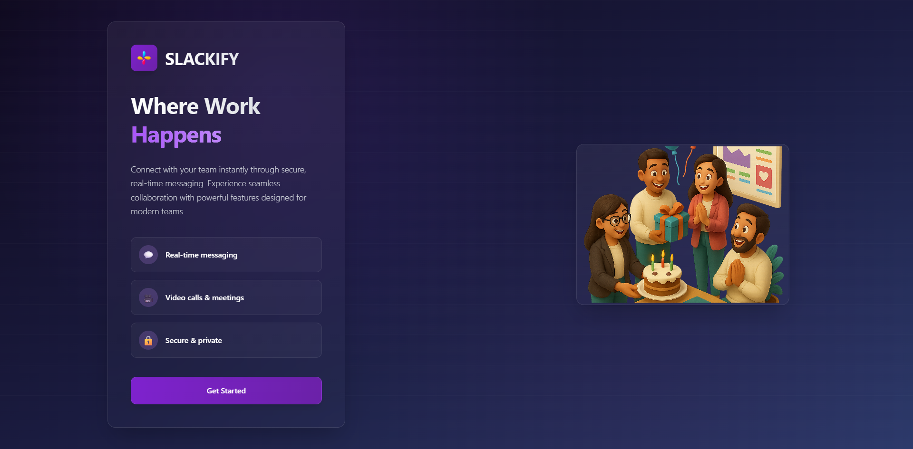
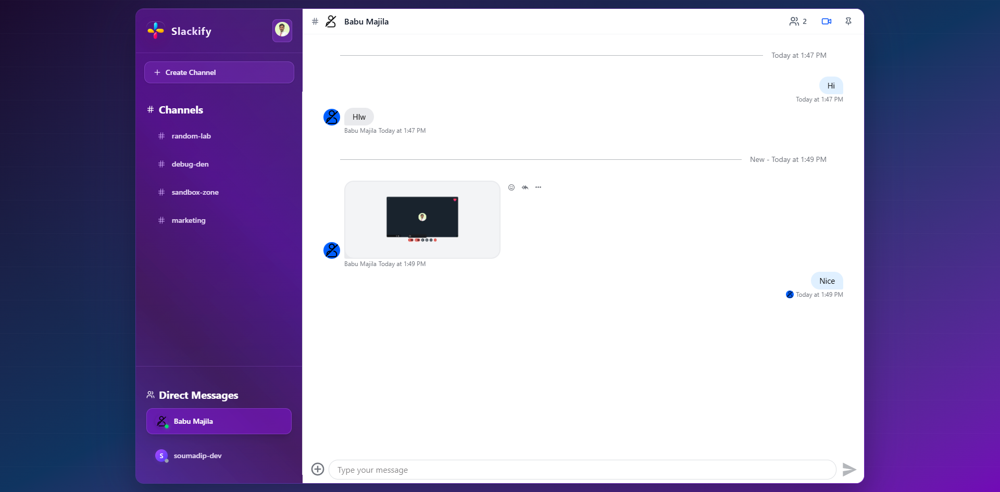
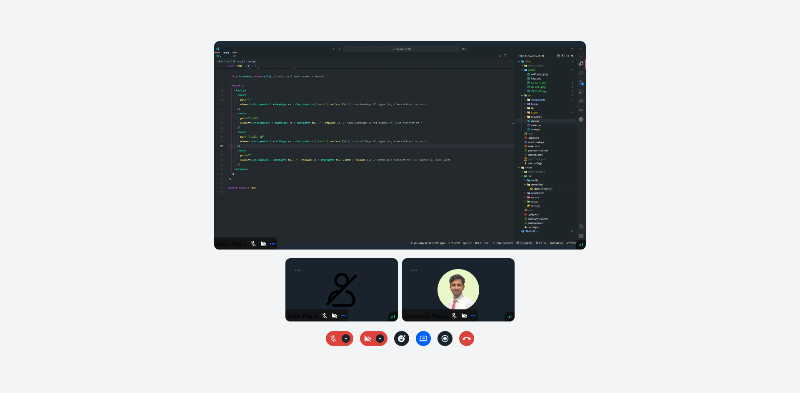

<h1 align="center">
  <br>
  Slackify 💬 
  <br>
</h1>


<p align="center">
  A full-stack Slack-inspired communication app featuring real-time messaging, threads, reactions, polls, file sharing, 1-on-1 and group video calls with screen sharing, and more.
</p>

<table align="center">
  <tr>
    <th>Auth Page</th>
    <th>Chat Page</th>
    <th>Call Page</th>
  </tr>
  <tr>
    <td align="center">
      
    </td>
    <td align="center">
      
    </td>
    <td align="center">
      
    </td>
  </tr>
</table>

## Live:

[Slackify](https://slackify-delta.vercel.app/)

## 🌟 Features

- **💬 Real-time Messaging** – With threads, reactions, and pinned messages
- **📤 File Sharing** – Supports images, PDFs, ZIPs, and more
- **📊 Polls** – Multiple options, anonymous mode, suggestions, and comments
- **🔐 Clerk Authentication** – Secure onboarding and user management
- **👥 Channels & DMs** – Direct Messages and Private Channels
- **🎥 Video & Screen Sharing** – 1-on-1 and group video calls with screen sharing & recording
- **❤️ Live Reactions** – Real-time during video calls
- **⚙ Background Jobs** – Powered by Inngest
- **🚀 Scalable Backend** – Built using Stream for media and messaging pipelines

## ⚙️ Tech Stack

- **🎨 Frontend**: React.js, Tailwind CSS
- **🚀 Backend**: Node.js, Express.js
- **🗄 Database**: MongoDB
- **📡 Real-time Communication**: Stream
- **🔐 Authentication**: Clerk
- **⚙ Background Jobs**: Inngest

## 🛠️ Installation & Setup

### Prerequisites

- Node.js (v18 or higher)
- npm or yarn
- MongoDB Atlas account (or local MongoDB instance)

### Setup

1. **Clone the repository**

   ```bash
   git clone https://github.com/soumadip-dev/Slackify-MERN.git
   cd Slackify-MERN
   ```

2. **Backend Setup**

   ```bash
   cd server
   npm install
   ```

   Create a `.env` file in the `server` directory with:

   ```env
   PORT=8080
   MONGO_URI=<YOUR_MONGODB_URI>
   NODE_ENV=development
   CLERK_PUBLISHABLE_KEY=<YOUR_CLERK_PUBLISHABLE_KEY>
   CLERK_SECRET_KEY=<YOUR_CLERK_SECRET_KEY>
   STREAM_API_KEY=<YOUR_STREAM_API_KEY>
   STREAM_API_SECRET=<YOUR_STREAM_API_SECRET>
   INNGEST_EVENT_KEY=<YOUR_INNGEST_EVENT_KEY>
   INNGEST_SIGNING_KEY=<YOUR_INNGEST_SIGNING_KEY>
   ```

3. **Frontend Setup**

   ```bash
   cd ../client
   npm install
   ```

   Create a `.env` file in the `client` directory with:

   ```env
   VITE_CLERK_PUBLISHABLE_KEY=<YOUR_CLERK_PUBLISHABLE_KEY>
   VITE_STREAM_API_KEY=<YOUR_STREAM_API_KEY>
   ```

4. **Run the Application**
   - Backend (Terminal 1):
     ```bash
     cd server
     npm run dev
     ```
   - Frontend (Terminal 2):
     ```bash
     cd client
     npm run dev
     ```
