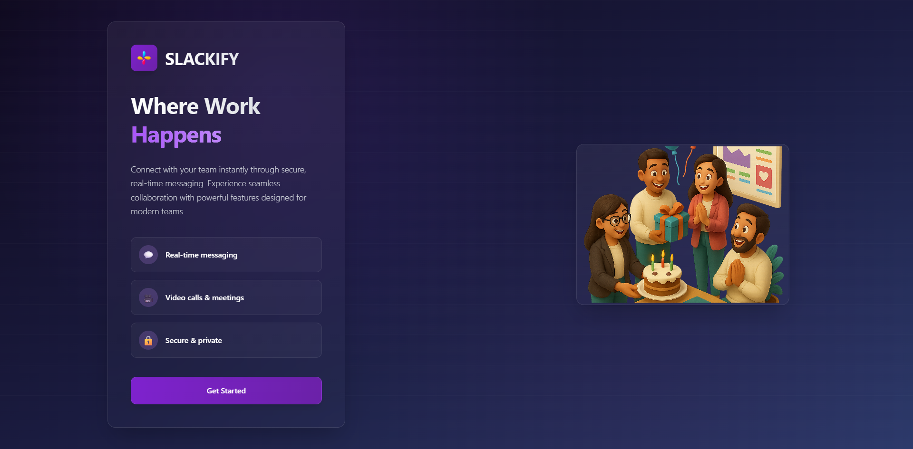

<h1 align="center">
   
  💬 Slackify (MERN) ⚡
   
</h1>

  

  A full-stack Slack-inspired communication app featuring real-time messaging, threads, reactions, polls, file sharing, 1-on-1 and group video calls with screen sharing, and more.

  

✨ Frontend in progress ✨

## 🌟 Features

- **💬 Real-time Messaging** – With threads, reactions, and pinned messages
- **📤 File Sharing** – Supports images, PDFs, ZIPs, and more
- **📊 Polls** – Multiple options, anonymous mode, suggestions, and comments
- **🔐 Clerk Authentication** – Secure onboarding and user management
- **👥 Channels & DMs** – Direct Messages and Private Channels
- **🎥 Video & Screen Sharing** – 1-on-1 and group video calls with screen sharing & recording
- **❤️ Live Reactions** – Real-time during video calls
- **⚙ Background Jobs** – Powered by Inngest
- **🐞 Error Monitoring** – Sentry integration for production-grade monitoring
- **🚀 Scalable Backend** – Built using Stream for media and messaging pipelines

## 🛠 Tech Stack

- **🎨 Frontend**: React.js, Tailwind CSS
- **⚙️ Backend**: Node.js, Express.js
- **🗄 Database**: MongoDB
- **📡 Real-time Communication**: Stream
- **🔐 Authentication**: Clerk
- **⚙ Background Jobs**: Inngest
- **🐞 Monitoring**: Sentry
